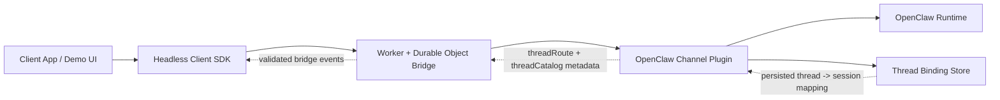
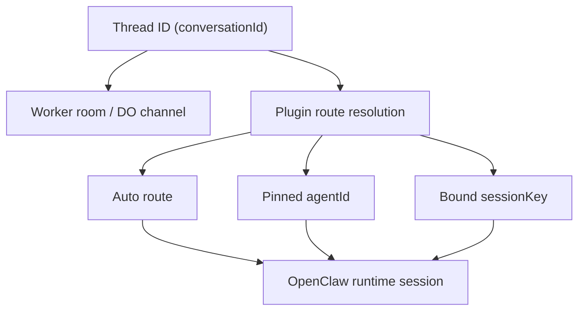
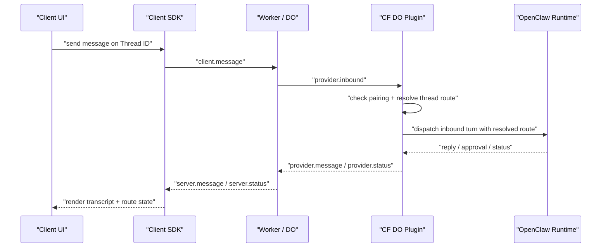
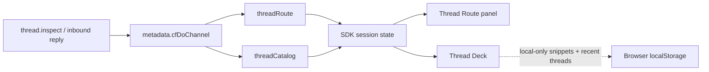

# Architecture

This repository is split into three layers:

1. Transport and runtime bridge
   Files: [src/index.ts](/Users/pandemicsyn/projects/cloudflare-openclaw-channel/src/index.ts), [src/auth.ts](/Users/pandemicsyn/projects/cloudflare-openclaw-channel/src/auth.ts), [src/jwt.ts](/Users/pandemicsyn/projects/cloudflare-openclaw-channel/src/jwt.ts)
   Responsibility: Cloudflare Worker and Durable Object endpoints, client JWT auth, provider auth, WebSocket fanout, room presence, and bridge status probes.

2. Shared protocol
   Files: [packages/channel-contract/src/index.ts](/Users/pandemicsyn/projects/cloudflare-openclaw-channel/packages/channel-contract/src/index.ts)
   Responsibility: wire types, route helpers, typed status events, typed UI payloads, and approval action envelopes shared by the Worker, client SDK, and OpenClaw plugin.

3. OpenClaw integration
   Files: [packages/openclaw-channel/src/channel.ts](/Users/pandemicsyn/projects/cloudflare-openclaw-channel/packages/openclaw-channel/src/channel.ts), [packages/openclaw-channel/src/bridge-manager.ts](/Users/pandemicsyn/projects/cloudflare-openclaw-channel/packages/openclaw-channel/src/bridge-manager.ts)
   Responsibility: native channel plugin behavior, pairing enforcement, inbound thread routing, session binding, outbound delivery, approval forwarding, and channel status probing.

There is also a fourth consumer-facing layer:

4. Headless client SDK
   Files: [packages/channel-client/src/index.ts](/Users/pandemicsyn/projects/cloudflare-openclaw-channel/packages/channel-client/src/index.ts)
   Responsibility: JWT issuance helper, WebSocket lifecycle, reconnects, typed events, approval actions, thread-route snapshots, and other first-class client state for custom apps or demo UIs.

5. Demo UI
   Files: [apps/web-demo/src/App.tsx](/Users/pandemicsyn/projects/cloudflare-openclaw-channel/apps/web-demo/src/App.tsx), [apps/web-demo/src/hooks/useChannelDemoSession.ts](/Users/pandemicsyn/projects/cloudflare-openclaw-channel/apps/web-demo/src/hooks/useChannelDemoSession.ts)
   Responsibility: reference presentation only. It consumes the SDK session state and may add local-only conveniences such as recent thread history, command completion, and compact message snippets.

## Thread Model

The most important identity rule in this repo is:

- `conversationId` is the channel thread key
- it is not the OpenClaw runtime session key

That separation exists across the stack:

1. The Worker uses `conversationId` only as the transport room/thread identifier.
2. The plugin resolves the effective route for that thread.
3. The route may:
   - auto-follow default/configured routing
   - pin the thread to a specific `agentId`
   - bind the thread to an explicit `sessionKey`
4. The client SDK exposes both:
   - the stable thread key
   - the resolved thread-route snapshot and agent catalog

This design is deliberate because the repo is meant to be forked into other channel integrations. Treating `conversationId` as a pseudo-session id leads to confused routing, leaky Worker semantics, and UI-specific hacks.

## Core Flow

1. A client obtains a JWT from `POST /v1/auth/token` using static credentials, or supplies an externally issued JWT.
2. The client SDK connects to `GET /v1/bridge/ws?role=client...`.
3. The Worker verifies the client, stamps the verified identity into the socket attachment, and upgrades into the account-scoped Durable Object.
4. The OpenClaw plugin opens its own persistent provider WebSocket to the same bridge with `role=provider`.
5. Client messages are broadcast to the room, marked `queued`, and forwarded to the provider socket as `provider.inbound`.
6. The plugin checks DM policy and pairing state.
7. If pairing is needed, the plugin emits `approval_required` and a structured pairing notice.
8. If access is allowed, the plugin resolves the thread route for that `conversationId`.
9. The resolved route selects the effective agent/session target for the turn.
10. The plugin dispatches the turn through OpenClaw’s direct-DM runtime using that resolved route.
11. Replies and status updates are emitted back through the provider socket and rebroadcast to room clients.

## Thread Routing Flow

The thread-routing flow is plugin-owned, not Worker-owned:

1. The client connects to a thread via `conversationId`.
2. The plugin resolves the thread route using:
   - default OpenClaw route resolution
   - configured conversation bindings
   - persisted CF DO thread bindings
3. The plugin emits first-class route metadata in `metadata.cfDoChannel`, including:
   - `threadRoute`
   - `threadCatalog`
4. The client SDK stores that route/catalog metadata in session state.
5. The demo UI renders route controls and recent-thread state on top of the SDK snapshot.

Persisted thread bindings currently live in:

- [thread-bindings.ts](/Users/pandemicsyn/projects/cloudflare-openclaw-channel/packages/openclaw-channel/src/thread-bindings.ts)

The demo’s recent thread deck is intentionally local-only and does not redefine channel semantics.

## Approval Flow

There are two distinct approval flows:

- Pairing approval
  The sender is not yet allowlisted for this channel. The plugin issues a pairing challenge and emits pairing-specific UI/status.

- Exec or plugin approval
  OpenClaw generates a first-class approval payload. The channel plugin converts that payload into bridge UI metadata and sends it to clients. A client can respond with `client.action { action.type = "approval.resolve" }`. The plugin validates the sender against `approvalAllowFrom` and resolves the approval through the OpenClaw gateway.

## Status Model

The bridge exposes these user-visible statuses:

- `queued`
  The user message was accepted and is waiting on OpenClaw.
- `typing`
  OpenClaw has accepted the turn and is actively working.
- `working`
  A bridge-side or plugin-side operation is in progress, such as access checks or approval submission.
- `approval_required`
  Human approval is needed before the flow can continue.
- `approval_resolved`
  An approval was accepted or denied.
- `final`
  The current turn is complete.

These statuses are transport-level events, not UI instructions. The client decides how to render them.

## Trust Boundaries

- The client cannot self-assert identity. Identity comes from a verified JWT subject.
- The Worker trusts only:
  - `CHANNEL_SERVICE_TOKEN` for provider routes
  - `CHANNEL_JWT_SECRET` for client JWT verification
- The Worker should stay transport-thin. It should not become the source of truth for pairing, approval meaning, or route/session semantics.
- The plugin trusts only the verified sender id forwarded by the Worker.
- Approval resolution is restricted by `approvalAllowFrom` in the channel config.

## Package Boundaries

- `packages/channel-contract`
  Lowest-level shared API. Keep it framework-free, stable, and suitable for downstream channel forks.

- `packages/channel-client`
  Primary integration surface for custom frontends. UI code should depend on this package, not on raw WebSocket contracts or Worker event guesses.

- `packages/openclaw-channel`
  OpenClaw-native plugin package. It should remain transport-aware but UI-agnostic, and it should own pairing, ingress routing, and thread/session binding semantics.

- `apps/web-demo`
  Reference app only. Local history, command hinting, and thread snippets are acceptable here as UX helpers, but they must not become the semantic source of truth.

The intended product shape is:

- headless SDK first
- demo UI second
- native OpenClaw plugin as the control-plane integration

## Testing Strategy

The current test split is:

- protocol and SDK tests
  Files: [packages/channel-contract/src/index.test.ts](/Users/pandemicsyn/projects/cloudflare-openclaw-channel/packages/channel-contract/src/index.test.ts), [packages/channel-client/src/index.test.ts](/Users/pandemicsyn/projects/cloudflare-openclaw-channel/packages/channel-client/src/index.test.ts)
  Purpose: fast validation of the stable wire contract and headless client behavior.

- Worker integration tests
  File: [src/index.integration.test.ts](/Users/pandemicsyn/projects/cloudflare-openclaw-channel/src/index.integration.test.ts)
  Purpose: validate Worker auth, token issuance, protected probe routes, and Durable Object reachability in the Cloudflare Workers test runtime.

The next layer after this should be WebSocket integration coverage for client and provider sockets across the real Worker runtime.
